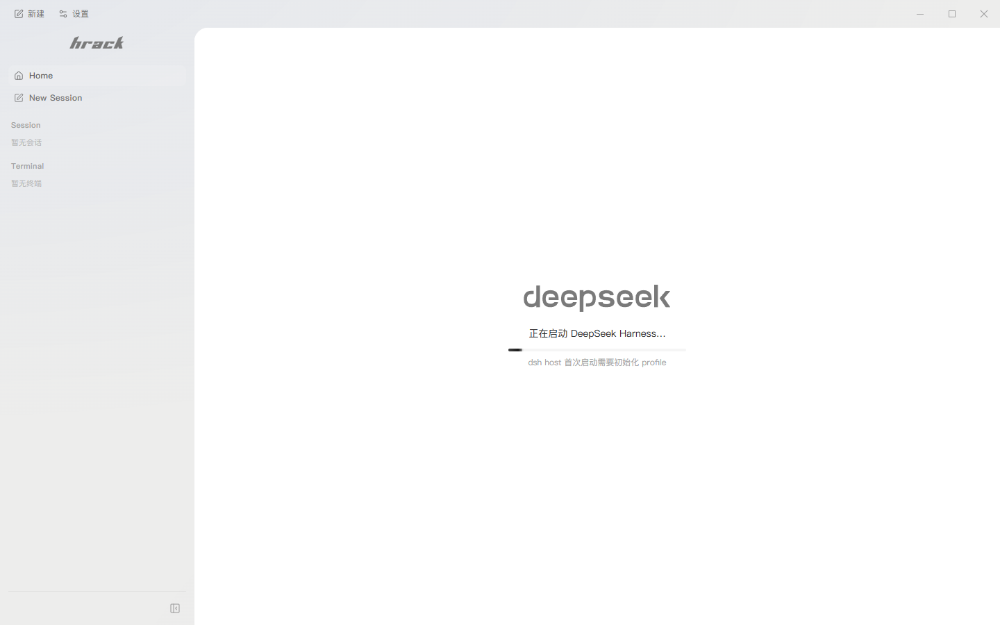

<p align="right">
  <a href="./README.zh-CN.md">简体中文</a>
</p>

<div align="center">
  <picture>
    <source media="(prefers-color-scheme: dark)" srcset="./assets/readme/hrack-wordmark-dark.png">
    
  </picture>

  <h3>A terminal built for coding CLIs</h3>
  <p><sub>Free your mind. Get back to vibe coding.</sub></p>

  <p>
    <a href="https://github.com/UniRound-Tec/HRack/releases"></a>
    <a href="https://github.com/UniRound-Tec/HRack/releases"></a>
    
    
    <a href="./LICENSE"></a>
  </p>
</div>

HRack — short for **Harness Rack** — is a desktop terminal for people who keep several coding agents open at once. It leaves each CLI's native TUI alone, then adds the missing layer around it: session status, attention cues, a floating monitor, and a read-only workspace viewer.

<div align="center">
  
</div>

## Why HRack?

Coding agents are supposed to save you time. In practice, a few things keep getting in the way:

- You switch to another window, come back later, and find the agent has been sitting on a permission prompt the whole time. Both [Codex](https://github.com/openai/codex/issues/10081) and [Gemini CLI](https://github.com/google-gemini/gemini-cli/issues/14696) users have asked for better alerts here.
- Once several agents are running, you spend too much time jumping between terminal tabs just to find the one that needs you. This comes up often in [parallel-agent workflows](https://news.ycombinator.com/item?id=47268777), and is why tools such as [tmux-claude-session-manager](https://github.com/craftzdog/tmux-claude-session-manager) exist.
- Notifications are not always enough. They can fail to fire ([Codex #8929](https://github.com/openai/codex/issues/8929)), miss an agent waiting for an answer ([Codex #13478](https://github.com/openai/codex/issues/13478)), or ignore an interactive shell waiting for input ([Gemini CLI #19527](https://github.com/google-gemini/gemini-cli/issues/19527)).

HRack is our attempt to fix that daily friction. It keeps the sessions together, shows which one needs you, and takes you back to the right place. The CLI still does the real work; HRack just helps you keep up with it.

## What it does

- **Tracks agent sessions.** See when a CLI is working, waiting for you, done, or no longer fully observed.
- **Gets your attention at the right time.** A small floating window keeps active sessions and approvals within reach.
- **Starts everything from one place.** Launch a regular shell or a detected coding CLI on Windows, WSL, macOS, or Linux.
- **Keeps code close.** Browse the workspace, read highlighted source, and preview Markdown in a read-only pane.
- **Still behaves like a terminal.** Native TUI input, mouse handling, scrollback, copy and paste, themes, fonts, and GPU rendering stay intact.

## Getting started

### Install

Download the latest build from [GitHub Releases](https://github.com/UniRound-Tec/HRack/releases):

- Windows x64: `HRack-Setup-*.exe`
- macOS Apple Silicon: `HRack-*-macos-arm64.dmg`
- Linux x64: `HRack-*-linux-x64.AppImage` or `HRack-*-linux-x64.deb`

The builds are not commercially code-signed yet, so the operating system may show a security prompt on first launch.

### First run

1. Start HRack and let the CLI scan finish.
2. Pick a terminal or coding CLI from the home screen.
3. Choose its runtime and workspace.
4. Start the session. HRack will keep the native TUI in the main pane and publish its status around it.

If Codex reports that hooks need review, open `/hooks` inside Codex, review the HRack hook definition, and trust it. A listener failure never terminates the CLI session; HRack falls back to lifecycle-only status instead.

For Kimi Code, HRack maintains a versioned, clearly marked Hook block in the effective user `config.toml` (`KIMI_CODE_HOME` or `~/.kimi-code`). The candidate is validated by `kimi doctor config` before installation, content outside the managed block is preserved byte-for-byte, and the hooks are silent no-ops when Kimi is launched outside HRack.

## CLI support

| CLI | Observer | Status available to HRack |
| --- | --- | --- |
| Claude Code | Official Hooks | Thinking phase, tools, approvals, completion |
| Codex CLI | Stable Hooks | Turns, tools, approvals, compaction |
| OpenCode | Server + SSE | Sessions, thinking, tools, questions, permissions |
| Pi | Extension API | Thinking, responses, tools, turns |
| Kimi Code | Official Hooks | Turns, thinking phase, tools, approvals |

HRack can also discover and launch Grok Build, Devin CLI, Cline, Qwen Code, Amp, Aider, Goose, Kiro CLI, and other registered CLIs. These launch-only integrations do not expose the same level of status detail.

## How status reaches the UI

```text
CLI ── PTY ──────────────────────────────> terminal
 └── hooks / SSE / extension events ──> adapter ──> sessions and alerts

workspace ── read-only access ──────────> file tree and viewer
```

Terminal bytes stay on the terminal path. Adapters only publish bounded, structured facts such as a turn starting, a tool finishing, or an approval being requested. If an observer stops working, the PTY keeps running.

## Development

```bash
npm install
npm run dev
```

`npm install` also bootstraps the bundled DSH fallback: the isolated dependency tree in `dsh-runtime/` is gitignored (~254 MiB), so `postinstall` (plus the `predev` / `pretypecheck` / `build` hooks) runs `npm run ensure:dsh`, which installs it on first run and is a fast no-op afterwards. HRack prefers a compatible local DSH installation when one is available.

Useful checks:

```bash
npm run typecheck
npm run build
npm run e2e:only
```

Windows packages must be built on Windows, macOS packages on macOS, and Linux packages on Linux. The guarded entry points are `npm run release:win`, `npm run release:mac`, and `npm run release:linux`.

## Contributing

Bug reports, reproducible edge cases, and focused pull requests are welcome. For observer changes, please include a fixture or runtime test that proves the event ordering and fallback behavior.

HRack is still in preview, so small, well-scoped changes are easier to review than broad rewrites. Open an [issue](https://github.com/UniRound-Tec/HRack/issues) before starting a large feature.

## License

HRack is licensed under the [Apache License 2.0](./LICENSE).

---

<div align="center">
  <sub>Built for people who live in coding CLIs.</sub>
</div>
