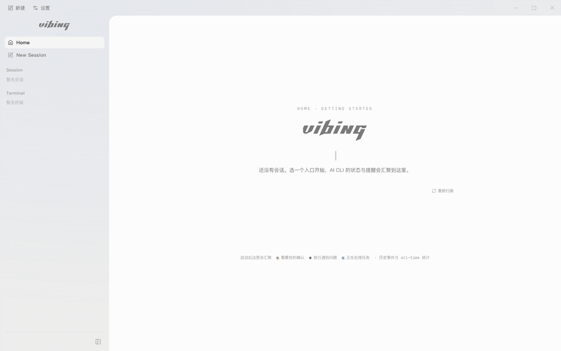
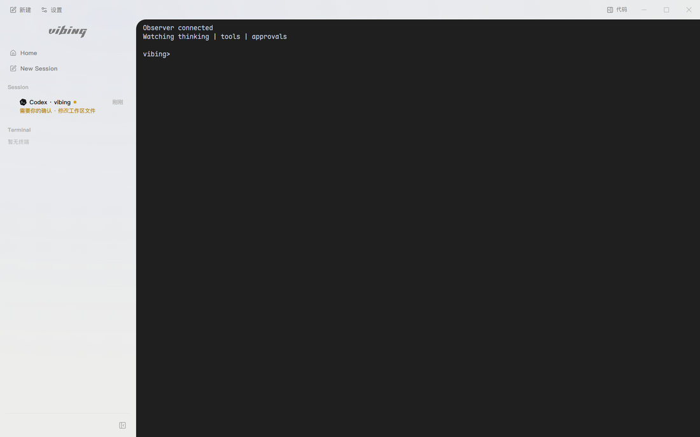
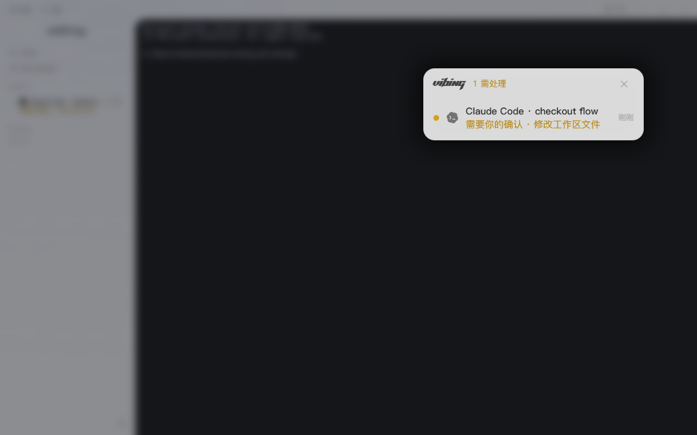
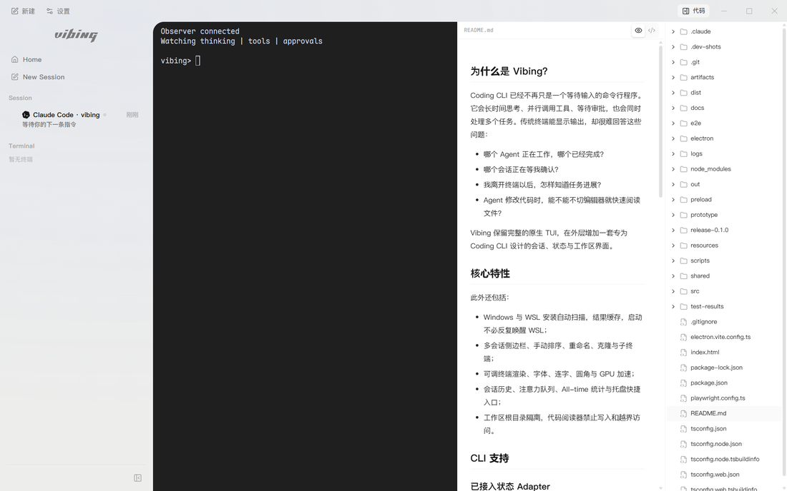
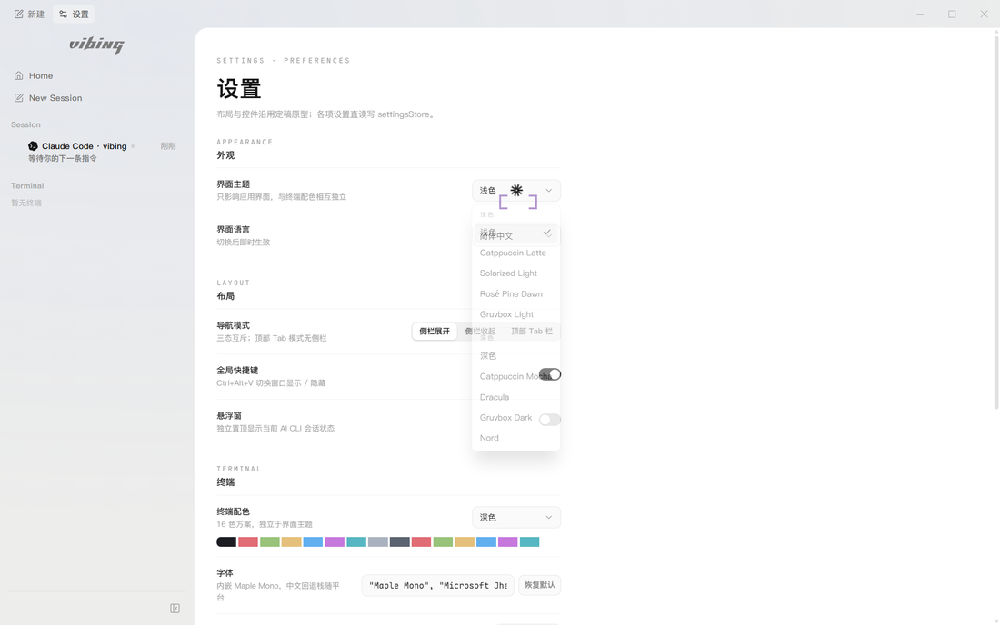

<div align="center">
  <picture>
    <source media="(prefers-color-scheme: dark)" srcset="./docs/assets/readme/vibing-wordmark-dark.png">
    
  </picture>

  <h3>新一代专用于 Coding CLI 的 Terminal</h3>

  <p>
    在一个原生终端里运行、观察和管理你的 AI Coding Agents。<br>
    不改变熟悉的 CLI 交互，只把思考、工具调用、审批与完成状态带到终端之外。
  </p>

  <p>
    
    
    
  </p>
</div>

<div align="center">
  
</div>

## 为什么是 Vibing？

Coding CLI 已经不再只是一个等待输入的命令行程序。它会长时间思考、并行调用工具、等待审批，也会同时处理多个任务。传统终端能显示输出，却很难回答这些问题：

- 哪个 Agent 正在工作，哪个已经完成？
- 哪个会话正在等我确认？
- 我离开终端以后，怎样知道任务进展？
- Agent 修改代码时，能不能不切编辑器就快速阅读文件？

Vibing 保留完整的原生 TUI，在外层增加一套专为 Coding CLI 设计的会话、状态与工作区界面。

## 核心特性

<table>
  <tr>
    <td width="50%">
      <h3>Agent 状态监听</h3>
      <p>统一呈现思考、工具调用、审批、完成与异常。多个 CLI 使用各自的原生协议接入，而不是靠终端文字猜状态。</p>
      
    </td>
    <td width="50%">
      <h3>独立悬浮窗</h3>
      <p>置顶查看活跃会话与待处理提醒。即使主窗口隐藏，也能知道哪个 Agent 需要你。</p>
      
    </td>
  </tr>
  <tr>
    <td width="50%">
      <h3>只读代码与 Markdown 预览</h3>
      <p>终端右侧展开工作区文件树，支持代码高亮、Markdown 自动渲染与文件变更刷新；只读设计，不与 Agent 抢文件控制权。</p>
      
    </td>
    <td width="50%">
      <h3>GUI 与终端双主题</h3>
      <p>界面主题和终端 16 色配色独立选择，内置浅色、深色与多套流行配色，代码高亮同步跟随主题。</p>
      
    </td>
  </tr>
</table>

此外还包括：

- Windows 与 WSL 安装自动扫描，结果缓存，启动不必反复唤醒 WSL；
- 多会话侧边栏、手动排序、重命名、克隆与子终端；
- 可调终端渲染、字体、连字、圆角与 GPU 加速；
- 会话历史、注意力队列、All-time 统计与托盘快捷入口；
- 工作区根目录隔离，代码阅读器禁止写入和越界访问。

## CLI 支持

### 已接入状态 Adapter

| CLI | 监听方式 | 当前能力 |
| --- | --- | --- |
| Claude Code | 官方 Hooks | 思考阶段、工具、审批、完成状态 |
| Codex CLI | Stable Hooks | 工具、审批、压缩与回合状态 |
| OpenCode | Server + SSE | 思考、工具、问题、权限与多会话聚合 |
| Pi | Extension API | 思考、响应、工具与回合状态 |

不同 CLI 暴露的原生事件不同，因此可展示的细节会略有差异；Vibing 会明确标记能力与降级状态，不把猜测伪装成事实。

### 扫描与启动

除上述 CLI 外，注册表还覆盖 Cursor Agent、Cline、Qwen Code、Amp、Kimi Code、Grok Build、GitHub Copilot CLI、Goose、Crush、Warp / Oz、Devin CLI、Kiro CLI、Aider、Factory Droid、Auggie、Mistral Vibe、Junie、Qoder CLI、CodeBuddy Code、Kilo Code、Trae Agent 等入口。

## 安装

当前发布重点是 **Windows 10/11 + WSL2**。

1. 从 [Releases](https://github.com/UniRound-Tec/vibing/releases) 下载最新的 `Vibing-Setup-*.exe`；
2. 安装时选择目标目录；
3. 首次启动完成 AI CLI 扫描；
4. 选择 CLI、运行环境与工作区后启动。

> macOS 与 Linux 的 Host 启动、扫描和 POSIX 监听链路已经按同一架构实现，正式安装包仍在补齐真机发布验证。

## 本地开发

```bash
npm install
npm run dev
```

常用门禁：

```bash
npm run typecheck
npm run build
npm run e2e:only
```

## 设计原则

- **原生 CLI 优先**：保留 Claude Code、Codex、OpenCode、Pi 等原始 TUI 与操作习惯；
- **事件优先于文本猜测**：优先使用官方 Hook、SSE 或 Extension API；
- **监听失败不杀会话**：Observer 降级时，CLI 和 PTY 仍可继续使用；
- **低敏投影**：侧边栏和历史只保存有界摘要，不把完整思考、工具输入输出或认证信息写入 UI 状态；
- **终端仍然是终端**：普通 Shell、多终端、复制粘贴、滚动和 TUI 鼠标语义都必须正常工作。

---

<div align="center">
  <sub>Vibing is being built for people who live in Coding CLIs.</sub>
</div>
