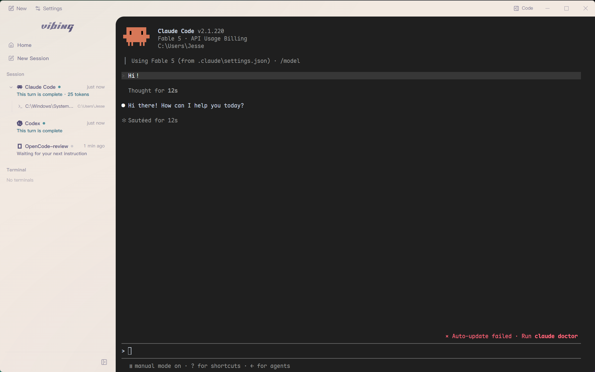
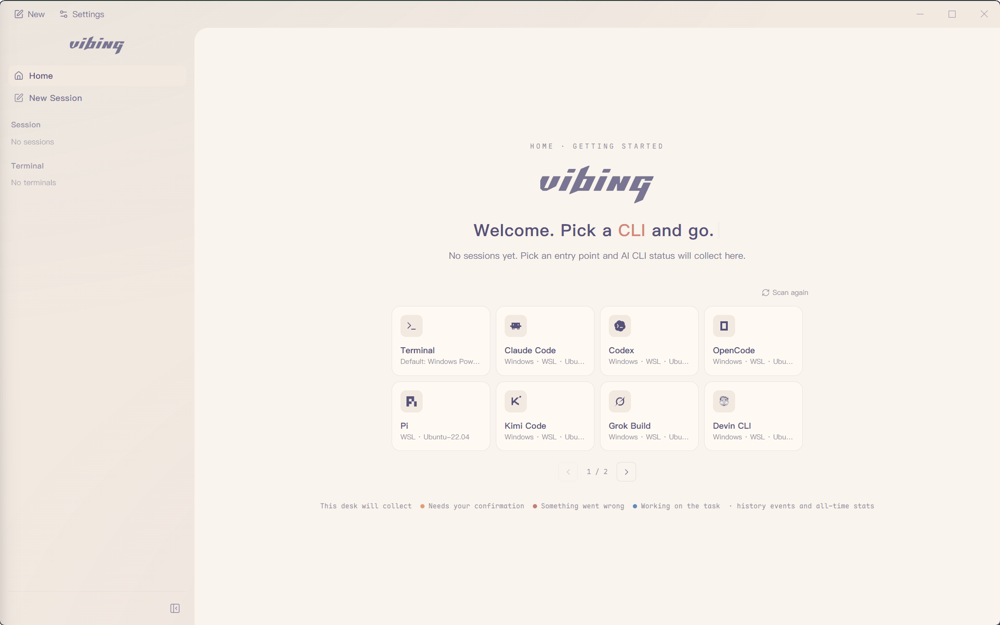
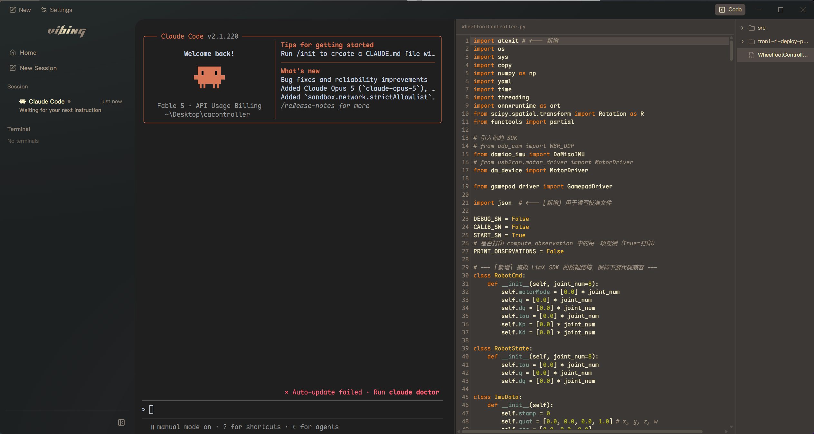

<div align="center">
  <picture>
    <source media="(prefers-color-scheme: dark)" srcset="./assets/readme/vibing-wordmark-dark.png">
    
  </picture>

  <h3>一个专为 Coding CLI 优化的终端</h3>
  <p><sub>解放心智，回到真正的氛围编程</sub></p>
</div>

## 核心特性

1. 监控各个 CLI 的实时运行事件，配合悬浮窗快速跳转，在需要你处理时及时提醒，不必在多个 CLI 之间频繁切换。
2. 提供统一入口，一键快速启动普通终端或 Coding CLI。
3. 内置侧边文件树和代码阅读器，方便随时查看代码。
4. 提供丰富的主题系统。
5. 还有更多专为 Coding CLI 优化的细节，等待你探索。

## 界面预览







## Getting Started

### 安装

1. 前往 [Releases](https://github.com/UniRound-Tec/vibing/releases) 下载适合当前系统的安装包：
   - Windows x64：`Vibing-Setup-*.exe`
   - macOS Apple Silicon：`Vibing-*-macos-arm64.dmg`
2. 安装并启动 Vibing。
3. 等待应用完成本机及 WSL 中的 Coding CLI 扫描。
4. 选择 CLI、运行环境与工作区，即可开始新的会话。

> 当前安装包尚未进行商业代码签名，系统可能显示安全提醒。

### 本地开发

```bash
npm install
npm run dev
```

常用检查命令：

```bash
npm run typecheck
npm run build
npm run e2e:only
```

## CLI 支持

### 已接入状态监听

| CLI | 监听方式 | 当前能力 |
| --- | --- | --- |
| Claude Code | 官方 Hooks | 思考阶段、工具、审批与完成状态 |
| Codex CLI | Stable Hooks | 工具、审批、上下文压缩与回合状态 |
| OpenCode | Server + SSE | 思考、工具、问题、权限与多会话聚合 |
| Pi | Extension API | 思考、响应、工具与回合状态 |

不同 CLI 暴露的原生事件不同，因此可展示的状态细节会略有差异。监听不可用时，Vibing 会诚实显示降级状态，但不会中断 CLI 或终端会话。

除上述深度适配的 CLI 外，Vibing 也能扫描并启动 Kimi Code、Grok Build、Devin CLI、Cline、Qwen Code、Amp、Aider、Goose、Kiro CLI 等常见入口。

## 设计原则

- **原生 CLI 优先**：保留 Coding CLI 原本的 TUI 与操作习惯。
- **事件优先于文本猜测**：优先使用官方 Hook、SSE 或 Extension API 获取状态。
- **监听失败不杀会话**：Observer 降级时，CLI 与 PTY 仍可正常使用。
- **工作区只读**：文件树和代码阅读器只负责查看，不与 Agent 抢夺文件控制权。
- **终端仍然是终端**：普通 Shell、复制粘贴、滚动和 TUI 鼠标操作都应保持可用。

---

<div align="center">
  <sub>Vibing is built for people who live in Coding CLIs.</sub>
</div>
