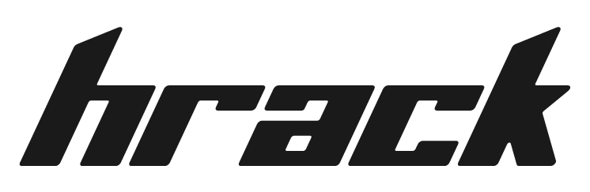
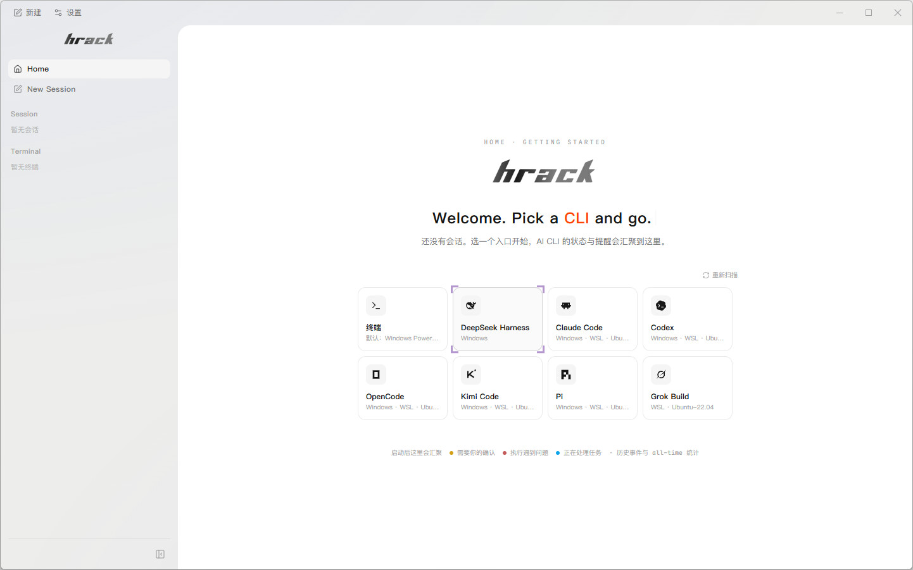
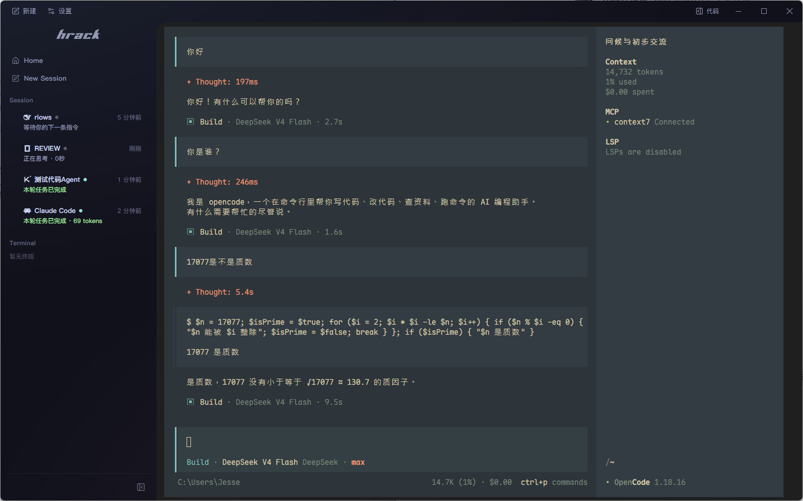
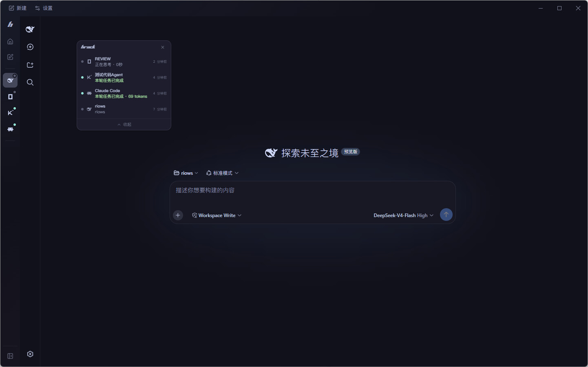
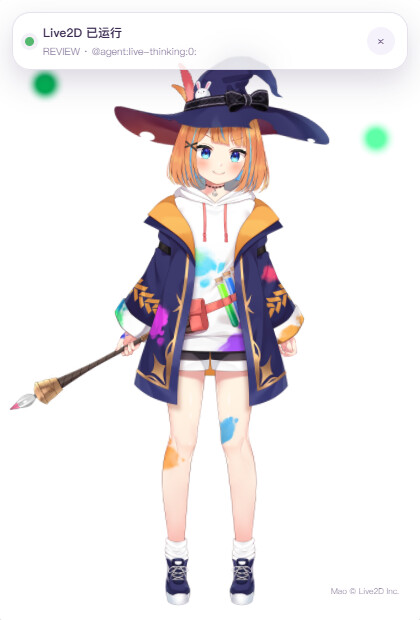
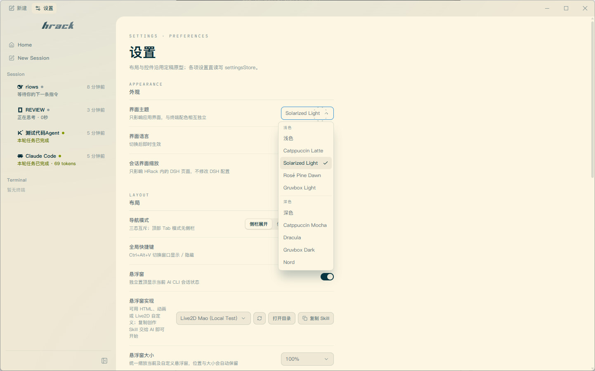
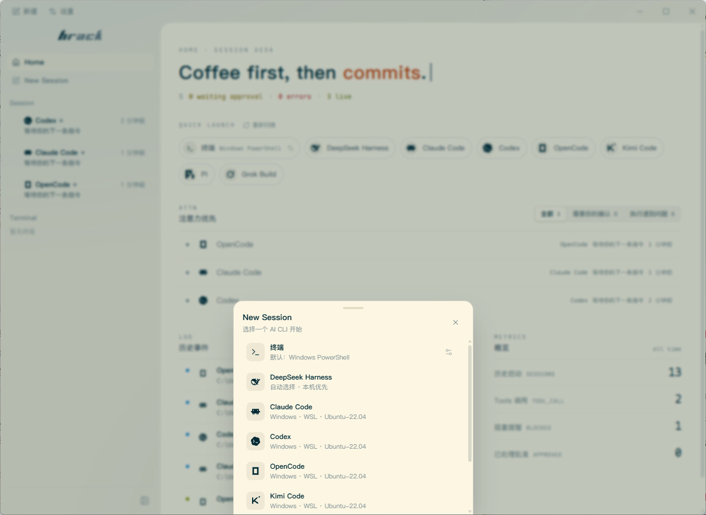

<p align="right">
  <a href="./README.md">English</a>
</p>

<div align="center">
  <picture>
    <source media="(prefers-color-scheme: dark)" srcset="./assets/readme/hrack-wordmark-dark.png">
    
  </picture>

  <h3>把每个 Coding Agent 放进同一个 Rack</h3>
  <p>保留原生 TUI，不再守着终端标签页。</p>

  <p>
    <a href="https://github.com/UniRound-Tec/HRack/releases"></a>
    <a href="https://github.com/UniRound-Tec/HRack/releases"></a>
    
    <a href="./LICENSE"></a>
  </p>
</div>

**HRack**（**Harness Rack**）是一个面向多 Coding Agent 工作流的桌面终端。它保留每个 CLI 原本的 TUI，在外层补上会话状态、注意力提醒、悬浮监控、快速启动和只读工作区浏览。

<div align="center">
  
</div>

## 解决什么问题？

不同 Coding Agent 各有所长，所以一个终端很快就会变成好几个。真正麻烦的不是把它们启动起来，而是一直看着它们：

- 切去做别的事，过一会儿回来，才发现 Agent 一直停在权限确认上白等。Codex 和 Gemini CLI 的用户都提出过类似的提醒需求（[Codex](https://github.com/openai/codex/issues/10081)、[Gemini CLI](https://github.com/google-gemini/gemini-cli/issues/14696)）。
- 同时跑几个 Agent 以后，人又开始在终端标签页之间来回找：“到底哪个在等我？”类似问题也出现在 [HN 的多 Agent 工作流讨论](https://news.ycombinator.com/item?id=47268777) 和 [tmux-claude-session-manager](https://github.com/craftzdog/tmux-claude-session-manager) 这类工具里。
- 有通知也不一定管用：它可能根本没触发（[Codex #8929](https://github.com/openai/codex/issues/8929)），不知道 Agent 正在等回答（[Codex #13478](https://github.com/openai/codex/issues/13478)），或者漏掉交互式 Shell 的输入等待（[Gemini CLI #19527](https://github.com/google-gemini/gemini-cli/issues/19527)）。

Vibe Coding 本来就该留点空间给人躺着刷手机、逛 L 站，而不是换一种方式盯进度条。😂

HRack 想解决的就是这些每天都会碰到的小麻烦：把会话放在一起，告诉你谁需要处理，再把你带回正确的位置。真正干活的仍然是原来的 CLI，HRack 只是让你不用一直盯着它。

## 怎么解决？

第一次启动时，HRack 会自动扫描主机和 WSL 中兼容的 CLI；之后直接使用缓存快速启动，也可以随时手动重扫。每个已支持的 Harness 都有自己的 Adapter，把官方 Hooks、SSE、Extension API 或运行时事件收敛成一套统一状态：

```text
正在思考 · 调用工具 · 需要你 · 本轮完成 · 发生错误
```

这些事实会同步到侧边栏、悬浮窗和历史记录，但不会进入终端字符流：

```text
CLI ── PTY ──────────────────────────────> 原生 TUI
 └── Hooks / SSE / Extension 事件 ────> Adapter ──> 状态与提醒

工作区 ── 只读访问 ─────────────────────> 文件树与阅读器
```

即使 Observer 失效，PTY 仍会继续运行。HRack 只会降级状态显示，不会拖垮 CLI 会话。

## 特性

### 一眼看懂每个 Agent 的状态

不同 Agent 可以同时运行。侧边栏会告诉你哪个正在思考、正在调用工具、等待你的确认、已经完成，或者监听能力已经降级。

<div align="center">
  
</div>

### 侧边栏收起来，状态仍然看得见

主侧边栏可以折叠成紧凑图标栏。内置监控窗仍会汇总所有已关注会话，点击即可回到正确位置。

<div align="center">
  
</div>

### 悬浮窗也可以完全自定义

默认悬浮窗本身就是一个内置 Renderer。自定义 Renderer 通过同一套公开接口接收真实会话状态，可以使用 HTML、CSS、JavaScript、动画库、Canvas，甚至 Live2D。设置页内置了一份简短 Skill，复制后交给你的 Coding Agent，就能帮你实现并安装自己的悬浮窗。

<p align="center">
  
  &nbsp;&nbsp;
  
</p>

二次元有福了。

### 不离开会话也能阅读代码

在终端旁打开只读文件树，查看语法高亮源码并预览 Markdown。Agent 的原生 TUI 仍然保留在左侧。

<div align="center">
  
</div>

### 主题、字体和布局都能调整

应用主题与终端主题彼此独立；终端字体、字号、导航模式、界面缩放和悬浮窗 Renderer 都可以在设置页配置。

<div align="center">
  
</div>

### 主机、WSL，一个入口快速启动

从 Home 或快速启动面板打开普通 Shell 和扫描到的 Coding CLI。HRack 支持主机安装和兼容的 WSL 发行版。DeepSeek Harness 只在扫描到本机或 WSL 安装后才显示。

<div align="center">
  
</div>

## 已支持的 Harness

| Harness | 接入方式 | HRack 可获得的状态 | 运行环境 |
| --- | --- | --- | --- |
| DeepSeek Harness | 官方 Web 页面 + Runtime Bridge | 已关注会话与生命周期 | 主机、WSL |
| Claude Code | 官方 Hooks | 思考、工具、审批、完成状态 | 主机、WSL |
| Codex CLI | Stable Hooks | 回合、工具、审批、上下文压缩 | 主机、WSL |
| OpenCode | Server + SSE | 会话、思考、工具、问题、权限 | 主机、WSL |
| Pi | Extension API | 思考、回复、工具、回合 | 主机、WSL |
| Kimi Code | 官方 Hooks | 回合、思考、工具、审批 | 主机、WSL |
| Grok Build | 官方 Hooks | 回合、思考、工具、审批 | 主机、WSL |

HRack 还可以扫描并启动 Devin CLI、Cline、Qwen Code、Amp、Aider、Goose、Kiro CLI、GitHub Copilot CLI 等注册表入口。仅启动接入的 CLI 暂时不会提供同等级别的状态细节；后续会继续抽象 Adapter 接口，让新的 Harness 可以按需加载。

## 安装

从 [GitHub Releases](https://github.com/UniRound-Tec/HRack/releases) 下载最新版本：

- Windows x64：`HRack-Setup-*.exe`
- macOS Apple Silicon：`HRack-*-macos-arm64.dmg`
- Linux x64：`HRack-*-linux-x64.AppImage` 或 `HRack-*-linux-x64.deb`

安装包暂时没有商业代码签名，首次启动时系统可能显示安全提醒。

### 第一次启动

1. 启动 HRack，等待第一次 CLI 扫描完成。
2. 选择普通终端或 Coding CLI。
3. 选择运行环境和工作区。
4. 创建会话。原生 TUI 会显示在主区域，HRack 负责在外围同步状态。

如果 Codex 提示需要审核 Hooks，请打开 `/hooks`，检查并信任 HRack 的 Hook 定义。对于 Kimi Code，HRack 会在当前生效的用户 `config.toml` 中维护一个带版本的托管块，并保留托管块之外的内容。Grok Build 会在 `~/.grok/hooks/`（或 `$GROK_HOME/hooks` / 对应 WSL 家目录）写入专用的 `hrack-observer.json`，属于 Grok 始终信任的用户级 Hook。

## 本地开发

克隆 HRack 时一并取得远程 App 和中继服务：

```bash
git clone --recurse-submodules https://github.com/UniRound-Tec/hrack.git
```

已有工作区可运行 `git submodule update --init --recursive` 完成初始化。两者的源码分别位于 `remotes/app` 和 `remotes/server`，便于在主仓库内索引，同时仍保留各自独立的版本历史。

```bash
npm install
npm run dev
```

常用检查：

```bash
npm run typecheck
npm run build
npm run e2e:only
```

Windows、macOS、Linux 安装包需要在对应系统上通过 `npm run release:win`、`npm run release:mac` 和 `npm run release:linux` 构建。DSH e2e 会通过 `npm run ensure:dsh` 安装隔离且不入库的 `dsh-runtime` 夹具，它不会打进发行包。

## 参与贡献

欢迎提交 Bug、可复现的边界情况和范围明确的 Pull Request。修改 Observer 时，请补充 fixture 或 Runtime 测试来证明事件顺序和降级行为。大型功能建议先开一个 [Issue](https://github.com/UniRound-Tec/HRack/issues)。

## 友情链接

- [LINUX DO](https://linux.do/)

## 开源协议

HRack 使用 [Apache License 2.0](./LICENSE) 开源。

---

<div align="center">
  <sub>解放心智，回到真正的氛围编程。</sub>
</div>
